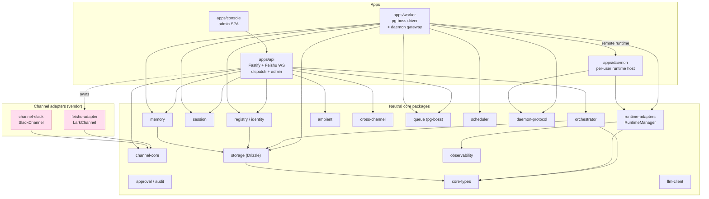
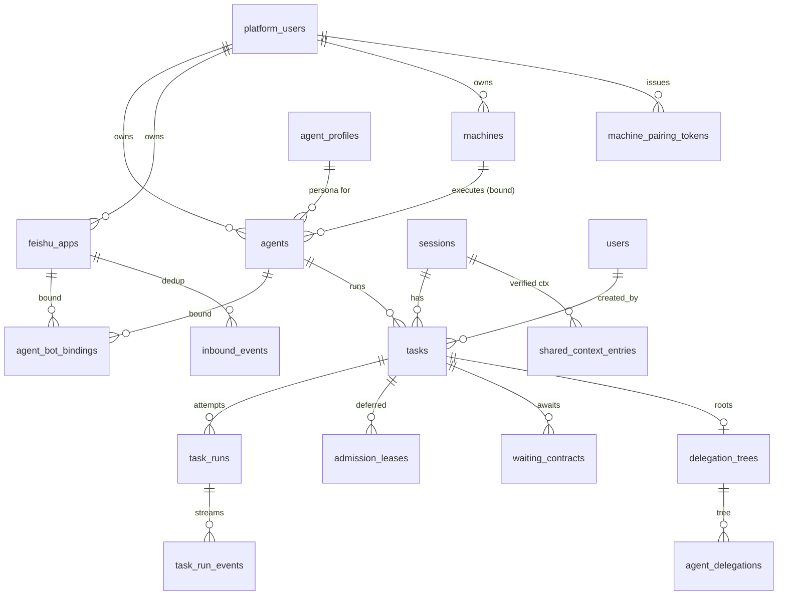

# OpenClaudeTag — Technical Design

> **Status:** Living architecture overview. This document is the current,
> synthesized technical design of OpenClaudeTag. It **supersedes the root
> [`DESIGN.md`](../../DESIGN.md)** as the living design overview (DESIGN.md
> remains the original vision/roadmap), and it sits **above the ADRs**: the
> nine records under [`doc/decisions/`](../decisions/README.md) are the
> authoritative accounts of individual decisions, while this document is the
> comprehensive, code-verified picture of how the pieces fit together today.
>
> Every architectural claim here was checked against the source on
> 2026-06-28; source paths are repo-root-relative.

## Table of contents

1. [Overview & thesis](#1-overview--thesis)
2. [Component map](#2-component-map)
3. [The two pluggable axes](#3-the-two-pluggable-axes)
4. [Core flows](#4-core-flows)
5. [Data model](#5-data-model)
6. [Deployment modes](#6-deployment-modes)
7. [Key architectural decisions (ADRs)](#7-key-architectural-decisions-adrs)
8. [Security & invariants](#8-security--invariants)
9. [Maturity & migration status](#9-maturity--migration-status)

---

## 1. Overview & thesis

OpenClaudeTag is a **vendor-neutral engineering agent for team chat**: a resident
AI teammate that lives in a chat channel, is summoned by `@mention`, keeps
per-channel shared memory, works in the open through a live task card, and can
follow up. It is an open re-implementation of the Claude Tag concept, which
hard-locks two axes — runtime = Claude, channel = Slack. OpenClaudeTag turns
**both axes into clean, pluggable abstractions**:

- **Channel** (`Channel` contract, `packages/channel-core`) — Lark/Feishu is the
  first implementation; Slack is the second proof.
- **Runtime** (`RuntimeAdapter` contract, `packages/runtime-adapters`) — Claude
  Code, Codex, and Coco are the implementations; a remote daemon is a fourth,
  proxy implementation.

**The orchestrator core names neither a vendor nor a runtime.** The intent
classifier, task state machine, and task-creation logic in
`packages/orchestrator` speak only the neutral `InboundMessage`
(`packages/channel-core/src/types.ts`) and a `runtimeHint` string; they never
import a Feishu or Slack client, and they never branch on a concrete runtime
class. Runtime selection is data-driven (`RuntimeManager.getHealthy(name)`), and
channel delivery flows through a `ChannelSender` seam resolved by the neutral
`ChannelKind`.

**The pipeline** is a single inbound → dispatch → execute → outbound loop:

```
channel event ─▶ normalize ─▶ InboundMessage ─▶ orchestrator (classify intent,
   create task) ─▶ pg-boss queue ─▶ worker (admit, resolve workdir, select
   runtime) ─▶ RuntimeAdapter execute → AsyncGenerator<RuntimeEvent> ─▶
   live task card / terminal feedback rendered back to the channel
```

**Dependency direction is strictly downward.** Channel adapters and the apps
(`apps/api`, `apps/worker`) depend on the neutral core packages; the core never
depends back on a vendor adapter. Vendor-specific payloads retreat behind a
typed `native: unknown` escape hatch on `InboundMessage.channel` and the
`{ kind: 'native' }` `OutboundMessage` variant.

> **A note on the `channel.native` fence.** DESIGN.md describes "a CI lint
> [that] keeps `channel.native` reads confined to `channel-*` packages." That
> guard is **aspirational and not yet implemented**: `eslint.config.mjs` defines
> only `no-unused-vars` and `no-explicit-any`, there is no `no-restricted-*`
> rule, grep guard, pre-commit hook, or CI step enforcing the confinement, and
> the staged channel-neutrality migration (ADR-0004) currently still reads
> `channel.native` outside `channel-*` packages — in
> `apps/api/src/server.ts` (`recoverFeishuNormalizedEvent`) and
> `packages/session/src/resolve.ts`. The escape hatch itself is real and typed;
> the lint that would mechanically prevent the core from re-coupling to Lark is
> a tracked follow-up. See [§9](#9-maturity--migration-status).

---

## 2. Component map

A pnpm monorepo (`pnpm-workspace.yaml`) of **5 apps** and **19 packages**.

### Apps

| App | Path | Responsibility |
| --- | --- | --- |
| **api** | `apps/api` | Fastify HTTP server + the sole Feishu `WSClient` (via `FeishuWsManager`); normalizes inbound events; dispatches tasks (lark-native body or the neutral seam); admin/console API; Slack events route; PR-polling; debug endpoints. |
| **worker** | `apps/worker` | pg-boss subscriber and the real task driver; admission/budget gate; workdir/sandbox resolution; runtime selection and `RuntimeEvent` consumption; terminal feedback; **hosts the daemon gateway** (`apps/worker/src/daemon-gateway/`) and the `RemoteRuntimeAdapter`. |
| **console** | `apps/console` | Static admin SPA (Vite/React); self-service ownership of Feishu apps, agents, machines, profiles, chats; pairing-token issuance. Served by `serve-console.mjs` (static + `/admin` `/health` proxy). |
| **daemon** | `apps/daemon` | Per-user execution daemon (`@open-tag/daemon`). Single outbound WSS to the worker's gateway; pairs once over REST; hosts local CLI runtimes; **holds no Feishu/DB credentials**. |
| **desktop** | `apps/desktop` | Electron macOS shell for the admin console (Experimental). Built per-arch DMG, served via `GET /admin/desktop/artifact`. |

### Packages

| Package | Responsibility |
| --- | --- |
| `channel-core` | Vendor-neutral channel contracts: `InboundMessage`, `OutboundMessage`, `ChannelScope`, `ConversationRef`, `DeliveryRef`, `ChannelCapabilities`, `Channel`, `ChannelRegistry`. |
| `feishu-adapter` | Lark/Feishu REST client, event normalizer, card builder, `LarkChannel` (implements `Channel`), `ThreePhaseFeedback`, `createFeishuChannelSender` / `FeedbackChannelSender`. |
| `channel-slack` | `SlackChannel` (implements `Channel`), Slack events handler, signature verification. |
| `orchestrator` | Channel/runtime-agnostic brain: keyword intent classifier, `handleEvent` (task creation), `transitionTask`, and the task state machine. |
| `runtime-adapters` | `RuntimeAdapter` contract, `RuntimeManager`, `buildRuntimeManager`, runtime descriptors, and the Claude Code / Codex / Coco adapters; workflow + soul loaders; worktree manager. |
| `storage` | Drizzle ORM schema, migrations, DB connection. The leaf everything composes over. |
| `session` | Session resolution (`resolveSession`), context building/strategy, lifecycle, slash-command helpers, reply-language. |
| `memory` | Always-on `channel_observations` ingestion; verified `shared_context_entries` (DeLM); scope-typed `memory_entries`; workspace agent memory; the shared sensitive-info filter. |
| `registry` | Agent manifests → `agents`/`agent_profiles` sync; the `Identity` read-model; per-identity budget (`checkBudget`/`recordUsage`); access bundles + credential injection (names-only); `/agent` command; agent↔bot bindings. |
| `ambient` | Opt-in proactive **post gate** (`evaluateAmbientPost`) and the stale-thread detector (`findStaleThreads`/`evaluateStaleThreadNudge`). Default-OFF, fail-closed, budget-gated. |
| `cross-channel` | Brokered, audited, `isPrivate`-safe cross-channel flag delivery (`evaluateCrossChannelFlag`). Default-OFF. |
| `launcher` | Personal zero-Docker bootstrap: the `DbProvider` contract (embedded / docker / external), the embedded-Postgres provider, and the `open-claude-tag` / `oct` CLI (`up`/`down`/`status`). |
| `queue` | `TaskQueue` over pg-boss v10 (`createQueue()` before `send()`). |
| `scheduler` | `AgentAdmissionScheduler` — per-agent concurrency admission control. |
| `approval` | RBAC + the audit service (`audit_events`). |
| `daemon-protocol` | Version-negotiated wire frames between the worker gateway and daemons (`PROTOCOL_VERSION = 1`), the replay buffer, and the seq tracker. |
| `core-types` | Zod models and enums: `IntentType`, `TaskStatus`, `RuntimeEvent`, ids (`stableUuidFromKey`), slash-command definitions, reply-language. |
| `observability` | Pino logger factory + fatal-handlers. |
| `llm-client` | Provider-agnostic LLM client (Anthropic + OpenAI behind a factory) for the platform's own LLM calls. |

### Component / dependency diagram



Arrows point in the direction of the `import` dependency (downward). The only
upward coupling — the API constructing a `LarkChannel`/Feishu client and the
worker constructing channel senders — lives in the **composition roots**
(`apps/api`, `apps/worker`), which are allowed to know both sides.

---

## 3. The two pluggable axes

### 3.1 Axis 1 — Channel (`packages/channel-core/src/types.ts`)

A channel adapter normalizes platform events into the neutral `InboundMessage`
and renders `OutboundMessage` back out. The contracts:

- **`ChannelCapabilities`** — feature/limit flags that drive graceful
  degradation: `supportsCards`, `supportsStreamingEdit`, `supportsThreads`,
  `supportsReactions`, `supportsForms`, `supportsApprovalButtons`,
  `supportsAttachmentsIn/Out`, and the numeric limits `maxOutboundChars`,
  `maxOutboundElements`, `maxUpdateRateHz` (e.g. Slack's ~1 Hz `chat.update`
  cap, which the worker coalesces to).
- **`ChannelScope`** — `{ kind, scopeId, installationId, threadId?, isPrivate }`.
  `scopeId` is **the unit of isolation** for memory and access;
  `installationId` is the tenant/workspace (Lark tenant key, Slack `team_id`);
  `isPrivate` scopes are excluded from cross-channel reads by default.
- **`ConversationRef`** — neutral threading (`{ kind, scopeId, threadId?, reply?:{ rootId, parentId } }`); Lark root/parent and Slack `thread_ts`/`ts` both map here.
- **`InboundMessage`** — `channel: { kind, native: unknown }` (the typed escape
  hatch), `eventId`/`messageId`/`eventType` (`created|updated|deleted|reaction|interaction`),
  `dedupeKey`, `conversation`, `scope`, `sender: { id, isBot }`, and `content`
  (text / command / `interaction` / `mentions` / `attachments` / `referenced`).
  A durable approval answer re-enters here as a `content.interaction`.
- **`OutboundMessage`** — a discriminated union the core speaks and the channel
  renders: `text`, `checklist`, `result`, `approval` (request-only), `form`,
  `comment`, `discussion`, `handoff`, `native`, `error`.
- **`DeliveryRef`** — a handle over the N physical messages a logical message
  segments into (`logicalMessageId` + monotonic `revision` + `physicalIds`),
  so `update()` can edit in place and drop stale low-revision writes.

The **`Channel`** interface is how an adapter plugs in: `capabilities()`,
`start(sink)`, `normalize(raw)`, `extractAddressingSignals(msg)` (the channel
emits neutral mention tokens; the **core** does roster matching), `send`/`update`,
optional `react`/`removeReaction`, `uploadArtifact`/`fetchAttachment`,
`resolveScope`, `healthcheck`. `LarkChannel`
(`packages/feishu-adapter/src/lark-channel.ts:162`) and `SlackChannel`
(`packages/channel-slack/src/slack-channel.ts:237`) implement the **same**
interface with different capability flags; vendor specifics stay behind `native`.

**The outbound `ChannelSender` seam.** Two mirror resolvers key delivery on the
neutral `ChannelKind` so a reply can never silently fall back to the wrong
vendor:

- API dispatch ACK: `resolveChannelSender(kind, ctx)`
  (`apps/api/src/channel-sender-resolver.ts`) — `lark` builds
  `createFeishuChannelSender(appContext.client)`; `slack` returns an injected
  `slackSender`; an unregistered kind **throws** (fail-fast).
- Worker terminal feedback: `resolveTaskChannelSender(kind, ctx)`
  (`apps/worker/src/channel-sender.ts`) — same mapping, but an unresolved kind
  returns `null` (the worker logs + skips delivery rather than crash a finished
  task; it **never** falls back to another vendor). The worker drives one
  `TaskFeedback` object regardless of channel: `ThreePhaseFeedback` (Lark live
  card) or `NeutralChannelFeedback` (Slack/neutral) both satisfy it.

### 3.2 Axis 2 — Runtime (`packages/runtime-adapters/src/types.ts`)

`RuntimeAdapter` is transport- and channel-neutral:
`name()`, `descriptor()`, `prepare(spec, ws)`, `execute(handle, spec, append?) → AsyncGenerator<RuntimeEvent>`,
`resume(sdkSessionId, prompt, ws, …)`, `cancel`, `collectArtifacts`,
`supportsResume`, `healthcheck`.

**The persisted-key vs open-id split is load-bearing:**

| Adapter | `name()` (persisted key, never rename) | `descriptor().id` (open display id) |
| --- | --- | --- |
| Claude Code | `claude_code` | `claude-code` |
| Codex | `codex` | `codex` |
| Coco | `coco` | `coco` |

`name()` is written to `sessions.runtimeBackend` and compared on resume, so it
must never change; `descriptor().id` is the open/hyphen id used for display and
registry lookup. `RUNTIME_DESCRIPTORS_BY_NAME` (`runtime-descriptors.ts`) maps
the persisted name → `RuntimeDescriptor`, with an own-key lookup so prototype
members are never mistaken for a runtime — proxy adapters (the worker's
`RemoteRuntimeAdapter`) resolve their descriptor through this map instead of
redefining capabilities.

**Descriptor-driven registry.** A `RuntimeDescriptor` declares
`capabilities` (`resume`, `enforcesReadOnly`, `interactivePermission`,
`sandboxModes`, `imageInput`, `modelSelection`), `credentialEnv` (env-var
**NAMES only**), and `workflowPrompts` (workflow basenames). The actual
capability differences are real and encoded in data:

- **Claude Code** — `enforcesReadOnly: true` (the SDK hard-denies file-mutating
  tools in read-only turns), `interactivePermission: true` (`canUseTool`), all
  three sandbox modes, `imageInput: 'base64'`,
  `credentialEnv: ['ANTHROPIC_BASE_URL','ANTHROPIC_API_KEY','ANTHROPIC_AUTH_TOKEN']`.
- **Codex** — read-only is advisory only (`enforcesReadOnly: false`), no
  interactive permission, hard-pins `danger-full-access`,
  `imageInput: 'local-path'`, `credentialEnv: ['CODEX_API_KEY','OPENAI_API_KEY']`.
- **Coco** — same advisory/headless profile, **no credential env** (authenticates
  via host git credentials).

`buildRuntimeManager(registrations)` (`runtime-manager.ts`) is the single
data-driven place that builds a `RuntimeManager`: each app hands it a list of
`RuntimeRegistration` (`isAvailable()` gates registration, `create()` builds the
adapter lazily), so an unavailable runtime never constructs.
`RuntimeManager.getHealthy(preferred)` returns the preferred adapter when
healthy, else falls back to any other healthy adapter. The registration **list is
per-app** (both apps use the same `buildRuntimeManager` factory): Claude always
registers; the **daemon** gates Codex/Coco on binary resolution
(`apps/daemon/src/runtime-registry.ts`), while the **worker** registers Codex
eagerly (`isAvailable: () => true`) and relies on the healthcheck to mark it
unhealthy if absent (`apps/worker/src/main.ts`).

**How a remote runtime plugs in.** `RemoteRuntimeAdapter`
(`apps/worker/src/remote-runtime-adapter.ts`) `implements RuntimeAdapter` and
proxies `prepare`/`execute`/`resume`/`cancel` to a daemon over the gateway —
"from the worker's view this is just another adapter producing a `RuntimeEvent`
stream." It is constructed per-dispatch and is **not** registered with
`RuntimeManager` (it is selected only when a task is machine-bound).

**`credentialEnv` mirrored by AccessBundle.** Both the runtime descriptor and an
access bundle (`packages/registry/src/access-bundles.ts`) declare credential
env-var **names** only; secret values are resolved and injected at execution
time via `buildInjectedCredentialEnv` (names validated against
`isCredentialEnvName` + a per-bundle prefix namespace, dangerous names like
`PATH`/`LD_PRELOAD`/`NODE_OPTIONS` rejected). Values never touch the descriptor,
the bundle, the plugin payload, or the channel.

---

## 4. Core flows

### 4.1 Inbound → execute → outbound (main loop)

```mermaid
sequenceDiagram
  participant CH as Channel (Lark WS / Slack HTTP)
  participant API as apps/api
  participant DB as Postgres (storage)
  participant Q as pg-boss (queue)
  participant W as apps/worker
  participant RT as RuntimeAdapter
  participant OUT as ChannelSender

  CH->>API: raw event
  API->>API: normalize → InboundMessage (channel.native preserved)
  alt un-addressed / observation
    API->>DB: ingestObservation → channel_observations
    API-->>API: ambient gate (default-OFF) → maybe post
  else addressed to bot
    API->>DB: dedup claim (inbound_events, ON CONFLICT DO NOTHING)
    API->>API: resolveSession
    API->>DB: orchestrator.handleEvent → task (PENDING, deterministic id)
    API->>OUT: ACK card / "Task queued" (capture DeliveryRef — ADR-0008)
    API->>DB: transitionTask → QUEUED
    API->>Q: enqueue TaskJobData (durable boundary)
  end
  Q->>W: deliver job
  W->>W: budget gate → admission slot → resolve workdir → select runtime
  W->>DB: transitionTask → RUNNING; create task_run
  W->>RT: prepare() then execute(spec)
  loop RuntimeEvent stream
    RT-->>W: plan_update / tool_use / output / …
    W->>DB: persist task_run_events
    W->>OUT: update live card (coalesced to maxUpdateRateHz)
  end
  RT-->>W: terminal
  W->>DB: transitionTask → COMPLETED/FAILED
  W->>OUT: TaskFeedback.updateDone/updateFailed (update ACK in place)
```

**Inbound dispatch — two paths.** After `normalizeEvent`, the API builds
`adaptNormalizedEvent(event) → InboundMessage`:

- **Lark native body** — `dispatchInboundMessageViaFeishuNative` recovers the
  `NormalizedEvent` from `channel.native` and runs the production-critical
  ~378-line Lark dispatch (thread/reference enrichment, agent access control,
  discussion / deferred-mention sub-handlers, the buffer gate, the slash-command
  tree, the "OK" reaction, topic/task-list tracking, provisional-session
  upgrade). This body is left **byte-identical** (ADR-0004/0005).
- **Neutral path** — `dispatchNeutralMessage(message, ctx)`
  (`apps/api/src/neutral-dispatch.ts`, ADR-0005) is a minimal, DI-pure mirror of
  the essential subset (`resolveSession` → `createTask` with a **deterministic
  id** → `QUEUED` → enqueue → ACK) with **no** Lark assumptions. It is the seam
  the **Slack route** enters through (the Feishu WS *and* webhook paths both go
  through `processEvent` → the lark-native body). Addressing is mention-only and
  opt-in (`SLACK_BOT_USER_ID` must be set).

**Failure contract — neutral path (ADR-0005/0008).** On the neutral path,
enqueue is the **durable boundary**: a post-creation failure is never turned into
a terminal `FAILED`; an enqueue failure propagates so the held dedup claim stays
open for a stale-claim redelivery (re-enqueue is idempotent per deterministic
task id). The ACK is best-effort — but on the `task_created` path it is sent
**before** the enqueue so its `DeliveryRef` can be captured and threaded into the
job (`constraints.ackDelivery = { kind, scopeId, messageId }`) for in-place
terminal updates. A `task_duplicate` recovery re-enqueues but does **not**
re-ACK. (The lark-native `task_created` path differs: it runs an explicit
compensation, `failTaskCreatedPipeline`, that *can* transition the task to
`FAILED` on a pipeline error — `apps/api/src/task-pipeline-compensation.ts`.)

**Task execution in the worker** (`apps/worker/src/main.ts`, `processTask`):
1. **Budget gate** — `enforceTaskAdmissionBudget` (fail-open on DB error,
   fail-closed on a confirmed per-identity cap).
2. **Admission slot** — `AgentAdmissionScheduler.admit`; if not admitted, the
   job is deferred (`admission_leases`) and re-scheduled, not dropped.
3. **Workdir/sandbox** — precedence `constraints.confirmedWorkDir` (per-turn) →
   `sessions.adhocWorkDir` (session) → `chat_configs.defaultWorkDir` (chat) →
   `OPEN_TAG_DEFAULT_WORKDIR` (env) → a stable per-agent home
   `~/.open-claude-tag/agents/<agentId>`. `self_dev` / `/dev` tasks are not
   redirected. Worktree vs in-place isolation is configurable.
4. **Runtime select** — a machine-bound task uses a `RemoteRuntimeAdapter`;
   otherwise `runtimeManager.getHealthy(preferredRuntime)` (`'auto'` resolves to
   the session/agent default or `claude_code`).
5. **RuntimeEvent stream** — `consumeEvents` iterates the `AsyncGenerator`
   behind a settlement-fence watchdog, persists each event to
   `task_run_events`, drives the checklist, and renders running-card updates.
6. **Terminal feedback** — `ThreePhaseFeedback` (Lark) or
   `NeutralChannelFeedback` (Slack), via the kind-resolved `ChannelSender`.

**Outbound delivery — in-place ACK update (ADR-0008).** A neutral task shows
**one** live-updating message: `NeutralChannelFeedback` reconstructs an `ackRef`
from `constraints.ackDelivery` and `update()`s that same message to its terminal
state (UX parity with Lark's card), falling back to a fresh send when no handle
is present (older jobs / failed ACK). Both are best-effort; an `update` failure
is swallowed, never retried as a send, so a partial edit can't double-post.

### 4.2 Remote execution (server + daemon)

When a task is machine-bound, the worker runs a `RemoteRuntimeAdapter` that
bridges to the user's daemon over the **daemon gateway the worker hosts**
(`apps/worker/src/daemon-gateway/`, default port 3001). The daemon dials a single
**outbound** WSS to `/daemon/ws`, authenticates with a
`Bearer <machineId>.<machineSecret>` credential, sends `hello`, and the protocol
is **version-negotiated**, server-authoritative (`daemon-protocol`,
`PROTOCOL_VERSION = 1`):

- Daemon→server frames: `hello`, `ping`, `task_accepted`, `task_rejected`,
  `task_event` (seq-numbered, replay-buffered), `task_lost`, `artifacts`.
- Server→daemon frames: `hello_ok` (with `resumeDispatchIds`/`cancelDispatchIds`
  to reconcile after a flap), `hello_error` (fatal codes
  `protocol_incompatible`/`revoked`/`superseded`), `pong`, `task_dispatch`,
  `event_ack`, `task_cancel`.

The daemon resolves the workdir on **its own** filesystem from `workdirHints`
(`confirmedWorkDir ?? adhocWorkDir ?? defaultWorkDir`, or the per-agent home
when `agent_home` is advertised), materializes inline images, and runs a local
adapter. A network flap shorter than the heartbeat deadline is invisible (events
replay); a longer one fails the task. The worker only picks the **display** path
for a remote run — it never materializes server-local worktrees for it.

### 4.3 Always-on observation memory

Every inbound message on a memory-enabled channel — **addressed or not** —
passes `ingestObservation` (`packages/memory/src/observations/ingest.ts`), the
"following the channel" write path. It ingests only substantive `created`/
`updated` **text** from a **non-bot** human, skips empty / slash-command /
`<2`-char / **sensitive** content, normalizes whitespace, stores a `gist` keyed
by `(channelKind, scopeId)` with a `sha256` dedupe (`ON CONFLICT DO NOTHING`),
and uses the **inbound** `occurredAt` (never wall-clock). It runs **no** evidence
verifier — this is observed human text, not agent output — but keeps the
sensitive filter. Reads (`hydrateChannelMemory`) are keyed by `(channelKind,
scopeId)` **only**, which is exactly the multiplayer property (any member sees
another member's channel activity) while cross-channel isolation holds because
scope is the sole predicate. This is **default-on**; only proactive *posting* is
opt-in.

### 4.4 Opt-in proactive behaviors (default-OFF, fail-closed)

| Behavior | Package / edge | Gate |
| --- | --- | --- |
| **Ambient post gate** | `ambient` `evaluateAmbientPost`; `apps/api/src/ambient-tap.ts` | 5 gates cheapest-first: enabled → substantive & un-addressed → within budget → free worth-saying heuristic → optional LLM judge. A thrown budget/judge fails closed (no post). |
| **Cross-channel flag broker** | `cross-channel` `evaluateCrossChannelFlag`; `apps/api/src/cross-channel-tap.ts` (ADR-0006) | Global switch ∧ per-(source,target) allowlist. **Security exclusions run before the allowlist**: `self_target`, `private_source`, `private_target`, `cross_tenant`. Every decision audited; raw `summary` never stored; audit-fail-closed on delivery. |
| **Stale-thread scanner** | `ambient` `findStaleThreads`/`evaluateStaleThreadNudge`; `apps/api/src/stale-thread-scanner.ts` (ADR-0007) | Unresolved = `tasks.status='waiting_approval'` only; stale clock = `max(task,session).updatedAt`; idempotency via a prior `stale_thread.nudge` audit row (no migration); same-channel only; sendable-scope allowlist; primary-API reconciler tick. |

All three are **complete no-ops** when their global flag is off (no query, no
audit, no send).

### 4.5 Conversation sandbox, budget, access bundles

- **Conversation sandbox** — a task's working directory is resolved
  deterministically per the precedence chain in §4.1; a confirmed workdir
  persists to `sessions.adhocWorkDir` and is shared across every agent in the
  session. Scratch lives under `WORKSPACES_ROOT` (default
  `~/.open-claude-tag/workspaces`), never the user's repo.
- **Budget** — `Identity.budget` (composed from `agents.budget`) is enforced by
  `checkBudget`/`recordUsage` against `identity_usage`, keyed `(identityId,
  period, windowKey)` where `windowKey` is derived from the event timestamp, not
  wall-clock. No cap ⇒ unlimited fast-path with no DB read.
- **Access bundles** — `identity_access_grants` → `resolveIdentityAccess`
  (fail-closed on an unknown bundle, `[]` for zero grants = zero-access default)
  → `buildInjectedCredentialEnv` injects only declared, namespace-validated
  credential **names** into the runtime process env at execution time.

### 4.6 Multi-agent: discussion, delegation, handoff

- **Discussion** — multiple agents take turns on a topic in a thread, bounded by
  `discussions.roundLimit`; participants and turns are persisted
  (`discussion_participants`, `discussion_turns`; one task per turn). See
  `doc/architecture/discussion-orchestration.md`.
- **Delegation** — an agent delegates sub-work to another agent under a budgeted
  tree (`delegation_trees` with `totalBudget`/`fanoutBudget`, `agent_delegations`
  with depth and permission scope); the parent task parks in
  `WAITING_DELEGATION` and resumes when children complete.
- **Handoff / waiting contracts** — a deferred agent's promise to act after a
  primary agent completes is a durable `waiting_contracts` row (created at
  multi-mention intake, woken by the worker completion hook, expired by the
  reconciler). The `{ kind: 'handoff' }` outbound renders the visible wake
  mention. This is the async-first, durable-wait model — never an in-memory
  promise.

---

## 5. Data model

Postgres via Drizzle (`packages/storage/src/schema.ts`). The entities that
matter most for the architecture:

**Dual identity.** `users` is the **Feishu** domain (keyed by `feishu_open_id`);
`platform_users` is the **console/admin** domain (keyed by `sso_sub`, with a
`role` of `superadmin` vs `user`). They are deliberately distinct: console
ownership (`platform_owner_id`) is what fail-closed per-creator visibility keys
on, while the Feishu `users` domain is who sent a chat message.

**Agents.** `agent_profiles` (persona: system/style prompt, skill refs, default
runtime/model) ← `agents` (a scoped, bindable instance with `machine_id` for
remote execution, `runtime_env`, `budget`, `memory_enabled`, console
`platform_owner_id`). `agent_bot_bindings` binds one active agent to one enabled
`feishu_apps` row (partial-unique on `status='active'` per agent and per app).

**Sessions & continuity.** `sessions` carries `sdk_session_id` +
`sdk_session_machine_id` (the substrate that owns the SDK state, for the
machine-switch check), `runtime_backend`, worktree/PR fields, `adhoc_work_dir`,
and `bound_machine_id`. `chat_active_sessions` maps `(tenantKey, chatId)` → the
active session; `chat_configs` holds per-chat defaults (workdir, runtime, default
agent/machine, chat-memory summary schedule). `agent_session_states` is per-agent
session state.

**Tasks & runs.** `tasks` (FSM `status`, `runtime_hint`, `constraints` jsonb,
`parent_task_id`, `executed_on_machine_id`, feedback-card fields) → `task_runs`
(one execution attempt, `runtime_backend`, `mode`, cost) → `task_run_events`
(the ordered RuntimeEvent stream, unique on `(run_id, event_index)`).
`task_steps` decomposes a task. The state machine
(`packages/orchestrator/src/task-state-machine.ts`): `PENDING → QUEUED → RUNNING
→ {WAITING_APPROVAL, WAITING_DELEGATION, COMPLETED, FAILED, CANCELLED}`, with
`FAILED → PENDING` retry; transitions are compare-and-swap (terminal states can't
be clobbered).

**Inbound dedup.** `inbound_events` — unique `(feishu_app_id, event_id)` with
`NULLS NOT DISTINCT`, the atomic dedup claim that serializes same-event dispatch.

**Memory (four distinct stores).** `channel_observations` (always-on, scoped by
`(channel_kind, scope_id)`, dedupe-hash unique), `memory_entries` (scope-typed
durable facts), `chat_memory_entries` (index/detail chat memory, ADR-0003), and
`shared_context_entries` (verified, no-self-verify DeLM coordination substrate
with a portable `evidence_ref`).

**Identity, budget, access.** `identity_usage` (per-window token/spend
accounting) and `identity_access_grants` (installed access bundles) — both use a
free-form `identity_id` varchar (not an FK), since an Identity id may be an agent
id or handle.

**Machines.** `machines` (paired daemons, `secret_hash`, reported
`capabilities`, `status`, `disconnect_requested_at`) and
`machine_pairing_tokens` (one-time, hashed, console-issued, single-use).

**Coordination & audit.** `waiting_contracts`, `admission_leases`,
`delegation_trees` + `agent_delegations`, `discussions` + `discussion_participants`
+ `discussion_turns`, and `audit_events` (the append-only audit log the
proactive gates and admin actions write to).

### ER diagram (core entities)



`identity_usage`, `identity_access_grants`, and `channel_observations` key on
free-form scope/identity strings rather than FKs, so they are intentionally
omitted from the FK graph above.

---

## 6. Deployment modes

| Mode | What runs | Notes |
| --- | --- | --- |
| **Personal (zero-Docker)** | `@open-tag/launcher` CLI (`oct up`) boots an **embedded Postgres** + API + Worker + Console on one host. | ADR-0009. `OPEN_TAG_DB_MODE=embedded` (default) lazy-imports `embedded-postgres`, `initdb`s into `~/.open-claude-tag/pgdata`, owns a long-lived `db-host` process; idempotent and never stops a Postgres it didn't start. Feishu stays disabled unless `OPEN_TAG_FEISHU_ACCESS=enabled`. |
| **Docker** | `infra/docker-compose.yaml` runs Postgres + API + Worker. | `OPEN_TAG_DB_MODE=docker`. Runtime creds mounted from host (`~/.claude`, `~/.codex`). |
| **External Postgres** | BYO Postgres; API + Worker. | `OPEN_TAG_DB_MODE=external` probes `DATABASE_URL` and owns no DB lifecycle. |
| **Server + daemon (team)** | Central API (sole Feishu WS) + Worker (hosts daemon gateway :3001) + Console; users pair per-machine daemons. | The team mode. See invariants below and `doc/deployment/server-mode.md`. |
| **Desktop** | Electron macOS shell wrapping the console (Experimental). | Built per-arch, served via `GET /admin/desktop/artifact`. |
| **Dev worktree isolation** | Isolated API/Worker on derived ports. | `DAEMON_GATEWAY_PORT = <isolated API port> + 2000`; Feishu-disabled by default; never point at the production Feishu app. |

**Server-mode invariants** (do not break — root `AGENTS.md`,
`doc/deployment/server-mode.md`):

- The central **API owns the only Feishu `WSClient`**; never run two stacks
  against one Feishu app.
- The **worker hosts the daemon gateway**; **daemons hold no Feishu or DB
  credentials** (only their own `machineId`/`machineSecret`, single outbound
  WSS).
- Machine-binding precedence: per-turn constraint → agent `machine_id` →
  session binding → chat default → server-local.
- `self_dev` / `/dev` tasks **always run server-local**.
- A bound-but-offline machine **fails fast** (the card names the machine and how
  to start the daemon); a machine-bound task **never** silently falls back to
  server-local.
- Feishu access gate (API and worker must agree): `INSTANCE_ROLE=primary` → live
  unless `OPEN_TAG_FEISHU_ACCESS=disabled`; `isolated` → disabled unless
  `=enabled`.

---

## 7. Key architectural decisions (ADRs)

| ADR | Title | Decision (one line) |
| --- | --- | --- |
| [0001](../decisions/0001-lighten-self-dev-flow.md) | Lighten the self-dev flow | Tier changes by blast radius (fast-dev vs self-dev); `design.md` on demand; record decisions as ADRs. |
| [0002](../decisions/0002-document-comment-session-resume.md) | Document-comment session resume | Key a doc-comment host session by `(tenant, file token, comment id, bot/agent)` so same-bot follow-ups resume the runtime session; reply id is metadata only. |
| [0003](../decisions/0003-chat-memory-index-detail-store.md) | Chat memory index + detail store | DB-owned chat memory scoped `(tenant_key, chat_id)`: a small index + bounded detail entries; injected as a compact untrusted `<chat_memory>` block; daily summary is a queued agent task. |
| [0004](../decisions/0004-inbound-message-pipeline-contract.md) | `InboundMessage` as the inbound contract | Make `InboundMessage` the task-pipeline contract, migrated behind a neutral seam in safe slices with golden tests; recover the Feishu `NormalizedEvent` from `channel.native` until consumers are migrated. |
| [0005](../decisions/0005-neutral-non-lark-task-dispatch.md) | Neutral non-lark dispatch path | Add a small **separate** `dispatchNeutralMessage` for non-lark inbound (Slack); leave the 378-line lark body untouched; enqueue is the durable boundary. |
| [0006](../decisions/0006-cross-channel-flag-broker.md) | Cross-channel flag broker | A pure, vendor-neutral, default-OFF broker; hard `isPrivate`/tenant exclusions checked **before** the allowlist; every decision audited without storing the summary; audit-fail-closed on delivery. |
| [0007](../decisions/0007-stale-thread-nudge-scanner.md) | Stale-thread nudge scanner | Unresolved = `waiting_approval` only; idempotency via the audit log (no migration); same-channel-only nudge; sendable-scope allowlist; single-primary reconciler tick. |
| [0008](../decisions/0008-neutral-ack-in-place-terminal-update.md) | Thread the neutral ACK handle | Capture the ACK `DeliveryRef` (only on `task_created`, before enqueue) into `constraints.ackDelivery` so the worker updates that same message in place — one live message, UX parity with lark. |
| [0009](../decisions/0009-embedded-postgres-db-provider.md) | Embedded-Postgres DB provider | A `DbProvider` contract with `embedded`/`docker`/`external` providers selected by `OPEN_TAG_DB_MODE` (default `embedded`, fails closed on unknown); zero-Docker personal install. |

---

## 8. Security & invariants

- **Server-centralized invariants** — the central API is the **sole Feishu WS
  owner**; **daemons are credential-less** (no Feishu, no DB; only their machine
  secret over a single outbound WSS); a machine-bound task **never silently
  falls back** to server-local (offline machine / down gateway / invalid binding
  all fail fast).
- **Per-creator fail-closed ownership** — console rows carry a
  `platform_owner_id`; a plain (dev-auth) user sees and mutates **only** their
  own Feishu apps, agents, machines, profiles, and the chats where they own an
  agent. Legacy NULL-owner rows are visible to superadmins only. Profile editing
  requires owning the **profile**, not merely an agent that uses it.
- **Admin auth + the XFF-spoofing fix (implemented).** The admin guard
  (`apps/api/src/admin-api.ts`) resolves identity as **dev-auth cookie (if
  enabled) → break-glass loopback/token → 403**. `isEffectivelyLoopback` reads
  the raw TCP peer (`request.socket.remoteAddress`) and, when an
  `X-Forwarded-For` header is present, trusts only the **last** (proxy-appended)
  hop — failing closed on a malformed/empty header. This is the implemented fix
  for the escalation path DESIGN.md flags (a same-host reverse proxy makes the
  raw peer loopback for every external caller; reading the **first** XFF hop let
  a remote attacker spoof loopback). The break-glass token is compared
  constant-time. **`dev-auth` is default-OFF** (`OPEN_TAG_DEV_AUTH=enabled`); off
  ⇒ the endpoints 404 and a forged `cc_dev_user` cookie is ignored. A break-glass
  superadmin has no `platform_user` row, so it cannot mint pairing tokens — that
  requires a dev-auth platform identity.
- **Machine pairing auth** — `POST /daemon/pair` (worker gateway) atomically
  single-use-claims a hashed one-time token and returns a `machineId` +
  `machineSecret`; the WS upgrade and `/daemon/whoami` authenticate with
  `Bearer <machineId>.<machineSecret>` (uniform 401 on any failure, revoked ⇒
  401).
- **Default-OFF / fail-closed proactive gates** — ambient posting,
  cross-channel flagging, and the stale-thread scanner are all off by default and
  fail closed on a thrown dependency; their security exclusions (cross-channel
  `isPrivate`/tenant) run **before** any allowlist.
- **Secrets never in the payload** — credentials are injected as runtime process
  env at `prepare()`/execution from declared **names** (runtime `credentialEnv` +
  access-bundle prefixes), validated and dangerous-name-rejected; they never
  enter the descriptor, the access bundle, the plugin payload, the queue job, or
  the channel.
- **Sensitive filter on observation memory** — `containsSensitiveInfo` (api
  keys, PEM blocks, GitHub/Slack tokens, `password=…` assignments) is the single
  shared gate across `channel_observations`, `memory_entries`, and
  `shared_context_entries`; observation gists are additionally
  `sanitizeGistForPrompt`-guarded and injected under an untrusted-context header
  (treated as the highest prompt-injection risk).

---

## 9. Maturity & migration status

Per DESIGN.md's own scoring: the **runtime axis is ~80% abstracted** (a clean
`RuntimeAdapter` + descriptor registry with three real adapters plus a remote
proxy), while the **channel axis is ~30% abstracted** — the neutral contracts
and a second adapter exist, but the production dispatch body is still Lark-shaped.

**The staged neutrality migration** (ADR-0004 → 0005 → 0008) is deliberately
incremental and safety-first:

- ADR-0004 made `InboundMessage` the inbound contract behind a seam, with golden
  characterization tests pinning behavior; the Feishu `NormalizedEvent` is
  recovered from `channel.native` at a recovery point that moves deeper each
  slice.
- The **~378-line lark dispatch body is left byte-identical**; non-lark inbound
  flows through the **separate** `dispatchNeutralMessage` (ADR-0005) rather than
  unifying the two now — the explicit choice to avoid risking the
  production-critical path.
- ADR-0008 brought Slack terminal UX to parity (one in-place-updated message).

**Done:** the neutral `Channel`/`Runtime` contracts; `LarkChannel` +
`SlackChannel`; the descriptor-driven runtime registry; the neutral
dispatch/ACK/feedback seam; always-on observation memory; the three opt-in
proactive gates; per-identity budget + access bundles; server + daemon team mode
with version-negotiated frames; the embedded-Postgres zero-Docker launcher.

**Deferred / not yet implemented:**

- **The `channel.native` CI lint fence** (see [§1](#1-overview--thesis)) — the
  guard that would mechanically confine `native` reads to `channel-*` packages
  does not exist; `native` is still read in `apps/api/src/server.ts` and
  `packages/session/src/resolve.ts` during the migration.
- **Slack production hardening** — Slack is opt-in and inert by default
  (mention-only addressing, no OAuth / Socket-mode install flow, no worker-side
  intermediate running-card updates; only the single terminal update). Slash
  commands, discussions, access control, thread/reference enrichment, and
  provisional-session aliasing are Lark-only.
- **Path unification** — the lark and neutral dispatch bodies have not been
  merged into one kind-agnostic dispatcher (ADR-0005 explicitly defers this).
- **Live-credential E2E** — real two-bot Feishu and Slack validation are on-demand
  and gitignored-credential-gated, not part of the default gates.
- Open product questions remain around memory reconciliation on channel-membership
  change, ambient/budget defaults, and third-party plugin/marketplace governance.

---

### See also

- [`DESIGN.md`](../../DESIGN.md) — original vision and roadmap (superseded here as the living overview).
- [`doc/decisions/`](../decisions/README.md) — the authoritative ADRs.
- [`doc/deployment/server-mode.md`](../deployment/server-mode.md) — server + daemon ops.
- [`doc/architecture/event-pipeline.md`](event-pipeline.md), [`task-cards.md`](task-cards.md), [`discussion-orchestration.md`](discussion-orchestration.md), [`admin-console.md`](admin-console.md), [`admission-scheduler.md`](admission-scheduler.md).
